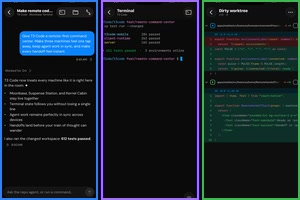

# Project Story

## About the project

T3 Code is a fast desktop and web interface for working with coding agents such as Codex and Claude. This project extends the open-source app with first-class [Jujutsu](https://jj-vcs.github.io/jj/) (`jj`) source control, safer review workflows, clearer approval controls, and a fork-owned nightly release pipeline.

The goal was not to put a different command behind buttons labelled “Git.” The goal was semantic parity: make the workflows people need—inspect, isolate, review, checkpoint, publish, and recover—feel native to both systems.

$$
\text{usable source control} = \text{workflow parity} + \text{native semantics} + \text{safe failure modes}
$$

## Inspiration

Coding agents are most useful when they can work quickly without making source control feel risky. Jujutsu offers a strong model for that work: changes are first-class, workspaces are cheap, conflicts are explicit, and rewriting history is normal. But most agent interfaces assume Git branches and worktrees everywhere.

I wanted T3 Code to support a Jujutsu user without forcing a hidden Git escape hatch. A jj workspace should be shown as a workspace, a bookmark should be shown as a bookmark, and publishing should move only the ref the user chose. I also wanted the fork to be usable by other people, not merely buildable on my machine, so the project includes documented, downloadable cross-platform nightlies from `michft/t3code`.

## How I built it

I started by mapping every existing Git workflow to its real product intent. That produced a phased plan covering detection, initialization, status, isolated workspaces, agent message context, finalization, sync, pull requests, reviews, checkpoints, client language, and rollout.

The implementation uses a shared VCS driver contract rather than spreading `if (jj)` checks through the product. The server detects the repository, selects the correct driver, and exposes driver-neutral status and workflow results to the clients. Machine-readable jj commands use explicit JSON templates, bounded output, typed parsing, cancellation, timeouts, and structured errors.

For isolated agent work, a thread receives a deterministic jj workspace identity derived from the thread ID. Reuse and deletion fail closed unless workspace ownership matches. Pull-request preparation uses explicit remote and bookmark data, including fork PRs, so it never silently falls back to the wrong remote. Durable checkpoints retain content through hidden local Git object refs while restore remains scoped to the selected jj workspace rather than restoring repository-wide operation state.

On the product side, shared selectors give web and mobile the right language and actions for each driver. Git keeps branch/worktree terminology; jj gets bookmark/workspace terminology. Approval questions gained direct thumbs-up and thumbs-down controls, numbered choices, and detail controls so planning conversations can move from question to implementation with less friction.

Finally, I built a fork-only GitHub Actions release workflow. It runs on standard GitHub-hosted Linux, macOS, and Windows runners, builds four unsigned desktop installers, produces updater metadata, checksums, and provenance, and publishes a prerelease to the fork. It deliberately excludes upstream production credentials, npm publishing, hosted deployment, and the managed relay.

## What I learned

The biggest lesson was that equivalent workflows do not mean equivalent nouns or command sequences. Git asks which branch is checked out. Jujutsu asks which change a workspace currently edits and which bookmark, if any, should be published. Preserving that distinction made the architecture simpler and the interface more honest.

I also learned to treat CLI output as an external protocol. Human-readable output is convenient until a version changes, a path contains unusual characters, or output is truncated. JSON templates, strict record guards, complete-output checks, and redacted typed failures turned those edge cases into a reliable contract.

Release engineering reinforced the same idea: a build is not a release until another person can identify it, download it, verify it, install it, understand its limitations, and report a problem to the right project.

## Challenges

The hardest challenge was workspace ownership. A path containing a valid jj checkout is not enough evidence that it belongs to the current thread or even the intended repository. Review, reuse, deletion, and restore paths therefore need deterministic identities and multiple matching ownership signals.

Cross-repository pull requests were another subtle boundary. Missing fork metadata must stop the workflow; falling back to `origin` can fetch or review the wrong code while appearing successful. The implementation resolves the fork explicitly and fails closed when that identity is unavailable.

CI also exposed practical constraints. The upstream release depends on private runners, signing credentials, cloud services, and deployment secrets that a community fork should not copy. The fork pipeline had to preserve a usable Windows WSL backend, merge multi-architecture macOS updater manifests, reject incomplete asset sets, and clearly document Gatekeeper and SmartScreen warnings for unsigned builds.

The work followed a simple rule throughout: **make it work, then make it good**. Each phase delivered a vertical workflow, then tightened parsing, ownership, telemetry, tests, documentation, and recovery behavior before moving on.

## Result

The result is a T3 Code fork where Jujutsu is a real source-control mode rather than an experimental translation layer. It can support local and isolated agent work, explicit publishing, fork-aware reviews, durable checkpoints, native client language, and reproducible desktop nightlies—while keeping Git behavior intact.
